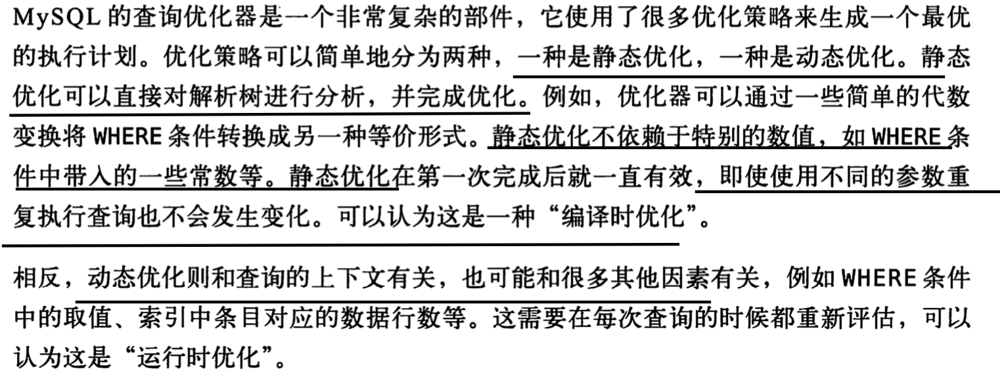

# mysql 学习笔记

# Q&A

## [MySQL中NULL对索引的影响](https://www.jianshu.com/p/3cae3e364946)

>看了很多博客，也听过很多人说，包括我们公司的 DBA，说MySql中如果某一列中含有null，那么包含该列的索引就无效了。
>
>翻了下《高性能MySQL第二版》和《MySQL技术内幕——InnoDB存储引擎第2版》，并没有看到关于这个的介绍。但在本地试了下，null 列是可以用到索引的，不管是单列索引还是联合索引，**但仅限于`is null`，`is not null`是不走索引的。**

以下摘自 《高性能mysql第三版》


## [MySQL中采用类型varchar(20)和varchar(255)对性能上的影响](https://blog.csdn.net/liqfyiyi/article/details/77868924)

>1.MySQL建立索引时如果没有限制索引的大小，索引长度会默认采用的该字段的长度，也就是说varchar(20)和varchar(255)对应的索引长度分别为20\*3(utf-8)(+2+1),255*3(utf-8)(+2+1)，**其中"+2"用来存储长度信息，“+1”用来标记是否为空**，加载索引信息时用varchar(255)类型会占用更多的内存；（备注：**当字段定义为非空的时候，是否为空的标记将不占用字节**）
>
>varchr(10) 变长字段且允许NULL:10*(Character Set：utf8=3,gbk=2,latin1=1)+1(NULL)+2(变长字段) 
>
>varchr(10) 变长字段且不允许 NULL: 10*(Character Set：utf8=3,gbk=2,latin1=1)+2(变长字段) 
>
>char(10) 固定字段且允许 NULL:10*(Character Set：utf8=3,gbk=2,latin1=1)+1(NULL) char(10)固定

varchar(M)其中M代表该数据类型所允许保存的字符串的最大长度，**只要长度小于该最大值的字符串都可以被保存在该数据类型中。**因此，对于那些难以估计确切长度的[数据对象](https://baike.baidu.com/item/数据对象/3227125)来说，使用VARCHAR数据类型更加明智。 

[mysql中varchar(20)与varchar(255)区别](https://www.dazhuanlan.com/2019/10/15/5da5a37f1306a/)

>## varchar(20)与varchar(255)
>
>1.MySQL 建立索引时, 如果没有限制索引的大小，**索引长度会默认采用的该字段的长度.**
>
>varchar(20)和varchar(255)对应的索引长度分别为20\*3(utf-8)(+2+1),255*3(utf-8)(+2+1)，其中”+2”用来存储长度信息，“+1”用来标记是否为空，**加载索引信息时用varchar(255)类型会占用更多的内存**； （当字段定义为非空的时候，是否为空的标记将不占用字节） 
>
>2.varchar(20)与varchar(255)都是可变的字符串
>
>通常情况下使用varchar(20)和varchar(255)保存较短的字符串’hello world’时,占用的空间都是一样的，但使用长度较短的列却有巨大的优势。较大的列使用更多的内存，**MySQL通常会分配固定大小的内存块来保存值，这对排序或使用基于内存的临时表尤其不好。同样,也会发生在使用文件排序或者基于磁盘的临时表时。**

## varchar特点

​	   1、使用比固定长度类型(char)占用更少存储空间(除了使用ROW_FORMAT=FIXED创建的[MyISAM](https://baike.baidu.com/item/MyISAM)表)。
　　2、使用额外的1-2字节来存储值长度，列长度**<=255使用1字节保存，其它情况使用2字节保存。**例如varchar(10)会占用11字节存储空间，varchar(500)会占用502字节存储空间。
　　3、节约空间，所以性能会有帮助。在更新的时候会产生额外的工作。
　　4、5.0以上版本，取值或设置值都会保存字符串末尾的空格，4.1之前的版本都会把字符串末尾的空格删除掉。
　　5、最大长度远大于平均长度，很少发生更新的时候适合使用varchar，因为碎片更少了。

>(当使用ROW_FORMAT=FIXED创建MyISAM表时，会为每行使用固定的长度空间，这样设置不同的varchar长度值时，存储相同数据所占用的空间是不一样) 
>
>3.字符串较长 
>
>当20<字符长度<255,varchar(20)会报错,varchar(255)会正常插入.
>
>4.字符串特别长
>
>字符长度>255,可以选择更大的值,VARCHAR(M)定义的列长度为可变长字符串，M取值可以为0~65535(64K)之间，(VARCHAR的最大有效长度由最大行大小和使用的字符集确定。整体最大长度是65,532字节）
>
>但是,服务器选项 innodb_large_prefix 关闭时，**InnoDB 引擎单一字段索引的长度最大为 767 字节，当字节超过这个长度时,必须建立小于等于767字节的前缀索引。**
>
>**此外，BLOB和TEXT类型的列只能创建前缀索引。**
>
>**前缀索引能提高索引建立速度和检索速度，但是下面情况是无法使用前缀索引的：**
>
>- **索引覆盖扫描**
>- **通过索引的排序（order by, group by）**
>
>## varchar类型限制
>
>**1.存储限制**
>
>varchar 字段是将实际内容单独存储在聚簇索引之外，内容开头用1到2个字节表示实际长度（长度超过255时需要2个字节），因此最大长度不能超过65535字节。 
>
>**2.编码长度限制**
>
>字符类型若为gbk，每个字符最多占2个字节，最大长度不能超过32766字符;
>
>字符类型若为utf8，每个字符最多占3个字节，最大长度不能超过21845字符。
>
>若定义的时候超过上述限制，则varchar字段会被强行转为text类型，并产生warning。
>
>**3. 行长度限制**
>
>实际应用中,导致varchar长度限制的通常是一行定义的长度,就是表里所有字段定义的长度总和。https://dev.mysql.com/doc/refman/8.0/en/column-count-limit.html
>
>**MySQL要求一行的定义长度不能超过65535。若定义的表长度超过这个值**，则提示
>
>> ERROR 1118 (42000): Row size too large. The maximum row size for the used table type, not counting BLOBs, is 65535. You have to change some columns to TEXT or BLOBs。
>
>之所以可以用TEXT或者BLOBS代替,官方解释如下:
>
>> The internal representation of a MySQL table has a maximum row size limit of 65,535 bytes, even if the storage engine is capable of supporting larger rows. BLOB andTEXT columns only contribute 9 to 12 bytes toward the row size limit because their contents are stored separately from the rest of the row.
>
>**TEXT和BLOB在行限制中,只占用其中的9-12字节,因为实际内容的存储是和其他行分离的.**
>
>varchar在一般情况下存储都够用了。如果遇到了大文本，考虑使用TEXT/MEDIUMTEXT/LONGTEXT，LONGTEXT最大能到4G。


## [生产要不要开启MySQL查询缓存](https://juejin.im/post/6844904022650929166)

>按道理，MySQL Server默认打开，是鼓励用户使用缓存，但是大拿们却建议关闭此功能，并且国内各个云厂商提供的MySQL云服务中默认都是关闭这个功能，这是为什么？
>
>为了提高完全相同的Query语句的响应速度，MySQL Server会对查询语句进行Hash计算后，把得到的hash值与Query查询的结果集对应存放在Query Cache中。当MySQL Server打开Query Cache之后，MySQL Server会对接收到的每一个SELECT 语句通过特定的Hash算法计算该Query的Hash值，然后通过该哈希值到Query Cache中去匹配。
>
>​	1. 如果没有匹配，将这个hash值存放在一个hash链表中，并将Query的结果集存放到cache中，**存放hash值链表的每个hash节点存放了相应Quey结果集在cache中的地址**，以及该query所涉及到一些table相关信息；
>
>​	2. 如果通过hash值匹配到了一样的Query，则直接将cache中相应的Query结果集返回给客户端。
>
>显然，这对于频繁更新的表，查询缓存是不适合的，而对于一些不常改变数据且有大量相同SQL查询的表，查询缓存会节约很大的性能。
>
>
>
>在MySQL Server中打开 **Query Cache对数据库的读和写都会带来额外的消耗:**
>
>1) 读查询开始之前必须检查是否命中缓存。  
>
>2) 如果读查询可以缓存，那么执行完查询操作后，会查询结果和查询语句写入缓存。
>
>3) 当向某个表写入数据的时候，必须将这个表所有的缓存设置为失效，如果缓存空间很大，则消耗也会很大，可能使系统僵死一段时间，因为这个操作是靠全局锁操作来保护的。
>
>4) 对InnoDB表，当修改一个表时，设置了缓存失效，但是多版本特性会暂时将这修改对其他事务屏蔽，在这个事务提交之前，所有查询都无法使用缓存，直到这个事务被提交，所以长时间的事务，会大大降低查询缓存的命中
>
>**3.4 缓存机制中的内存管理**
>
>当服务器启动的时候，会初始化缓存需要的内存，是一个完整的空闲块。当查询结果需要缓存的时候，先从空闲块中申请一个数据块为参数query_cache_min_res_unit配置的空间，即使缓存数据很小，申请数据块也是这个，因为查询开始返回结果的时候就分配空间，此时无法预知结果多大。
>
>但是如果并发的操作，余下的需要回收的空间很小，小于query_cache_min_res_unit，不能再次被使用，就会产生碎片。
>
>
>
>## 七、MySQL Query Cache优缺点
>
>**7.1. 优点**Query Cache的查询，发生在MySQL接收到客户端的查询请求、查询权限验证之后和查询SQL解析之前。也就是说，当MySQL接收到客户端的查询SQL之后，仅仅只需要对其进行相应的权限验证之后，就会通过Query Cache来查找结果，甚至都不需要经过Optimizer模块进行执行计划的分析优化，更不需要发生任何存储引擎的交互。由于 Query Cache 是基于内存的，直接从内存中返回相应的查询结果，因此减少了大量的磁盘I/O和CPU计算，导致效率非常高。
>
>**7.2. 缺点**Query Cache的优点很明显，但是也不能忽略它所带来的一些缺点：
>
>- 查询语句的hash计算和hash查找带来的资源消耗。如果将query_cache_type设置为1（也就是ON），那么MySQL会对每条接收到的SELECT类型的查询进行hash计算，然后查找这个查询的缓存结果是否存在。虽然hash计算和查找的效率已经足够高了，一条查询语句所带来的开销可以忽略，但一旦涉及到高并发，有成千上万条查询语句时，hash计算和查找所带来的开销就必须重视了。
>- Query Cache的失效问题。如果表的变更比较频繁，则会造成Query Cache的失效率非常高。表的变更不仅仅指表中的数据发生变化，还包括表结构或者索引的任何变化。
>- 查询语句不同，但查询结果相同的查询都会被缓存，这样便会造成内存资源的过度消耗。查询语句的字符大小写、空格或者注释的不同，Query Cache都会认为是不同的查询（因为他们的hash值会不同）。
>- 相关系统变量设置不合理会造成大量的内存碎片，这样便会导致Query Cache频繁清理内存。

## mysql中的索引是怎么存的？

>数据库中索引是以文件的方式存储的，需要用的时候读取到内存中，因此索引的I/O操作会影响数据库的性能；
>
>此外**插入和更新操作会更改索引，因此会影响数据库插入和更新的性能，并且索引会占用一定的磁盘空间，使数据库变大。**
>
>作者：ericsonyc
>链接：https://www.jianshu.com/p/25f95bd881d7
>来源：简书
>著作权归作者所有。商业转载请联系作者获得授权，非商业转载请注明出处。

## mysql中的复合索引的内部数据结构是怎么样？

# 官网

## 14.7.1 InnoDB Locking

https://dev.mysql.com/doc/refman/5.7/en/innodb-locking.html

innodb 引擎各种锁的引擎；

>
>
>

## Changes in MySQL 5.6.5 (2012-04-10, Milestone 8)

- Previously, at most one [`TIMESTAMP`](https://dev.mysql.com/doc/refman/5.6/en/datetime.html) column per table could be automatically initialized or updated to the current date and time. This restriction has been lifted. Any [`TIMESTAMP`](https://dev.mysql.com/doc/refman/5.6/en/datetime.html) column definition can have any combination of `DEFAULT CURRENT_TIMESTAMP` and `ON UPDATE CURRENT_TIMESTAMP` clauses. In addition, these clauses now can be used with [`DATETIME`](https://dev.mysql.com/doc/refman/5.6/en/datetime.html) column definitions. For more information, see [Automatic Initialization and Updating for TIMESTAMP and DATETIME](https://dev.mysql.com/doc/refman/5.6/en/timestamp-initialization.html).

# 文章

## 29.2. 预写式日志(WAL)

http://www.postgres.cn/docs/9.3/wal-intro.html

>*预写式日志*(WAL) 是一种确保数据完整性的标准方法。有关它的详细描述可以在大多数(如果不是全部的话)有关事务处理的书中找到。简而言之， **WAL的中心思想是对数据文件的修改(它们是表和索引的载体) 必须只能发生在这些修改已经记录到日志之后，也就是说， 在描述这些变化的日志记录刷写到永久存储器之后。如果我们遵循这个过程， 那么就不需要在每次事务提交的时候都把数据页刷写到磁盘， 因为在出现崩溃的情况下可以用日志来恢复数据库： 任何尚未应用于数据页的修改都可以先从日志记录中重做(这叫向前滚动恢复，也叫 REDO)。**
>
>使用WAL显著地减少了磁盘写的次数，因为只有日志文件需要刷写到磁盘以保证事务被提交， 而不是事务修改的所有数据文件都需要刷写到磁盘。日志文件是顺序写的，所以同步日志的开销要远比刷写数据页的开销小。 尤其对于有很多修改不同数据存储位置的小事务的服务而言更是如此。另外，当服务器正在处理许多小的并发事务时， 日志文件的一个`fsync`足以提交许多事务。
>
>WAL 还提供了数据库在线备份和基于时间点恢复的可能，就像[第 24.3 节](http://www.postgres.cn/docs/9.3/continuous-archiving.html) 里描述的那样。通过归档的 WAL 文件，可以将数据库恢复到 WAL 文件包含的任意时刻： 只需要简单地安装以前的数据库物理备份，然后重做 WAL 到希望的时间点。另外， 物理备份不必是数据库状态的一个即时快照；如果其制作花了较长的时间周期， 对于该周期内WAL日志的重做将修复任何内部的不一致。

## MySQL的WAL机制

https://blog.csdn.net/L_IK_Y/article/details/121792251

>## MySQL的WAL机制
>
>WAL 全称为 Write-Ahead Logging，预写日志系统。其主要是指MySQL在执行写操作的时候并不是立刻更新到磁盘上，而是先记录在日志中，之后在合适的时间更新到磁盘中。**日志主要分为 undo log、redo log、binlog**。
>当内存数据页跟磁盘数据页内容不一致的时候，我们成这个内存页为“脏页”。内存数据写入磁盘后，内存和磁盘上的数据页内容就一致了，称为“干净页”。
>**MySQL真正使用WAL的原因是：磁盘的写操作是随机IO，比较耗性能，所以如果把每一次的更新操作都先写入log中，那么就成了顺序写操作，实际更新操作由后台线程再根据log异步写入。这样对于client端，延迟就降低了。并且，由于顺序写入大概率是在一个磁盘块内，这样产生的IO次数也大大降低。所以WAL的核心在于将随机写转变为了顺序写，降低了客户端的延迟，提升了吞吐量。**
>
>## Undo log（逻辑性日志）
>
>**undo log 撤销，回滚。当事务回滚或者数据库崩溃的时候，可以利用undo log撤销未提交的事务对数据库产生的影响。**
>undo log 产生和销毁：**在事务开始前产生；事务在提交时，并不会立刻删除undo log，innodb会将该事物对应的undo log放入到删除列表中，后面会通过后台线程purge thread进行回收。**undo log属于逻辑日志，记录一个变化过程。例如执行一个delete语句，undo log会记录一个insert。
>undo log 存储：undo log采用段的方式进行管理和记录。在innodb数据文件中会包含一种rollback segment 回滚段，内部包含1024个 undo log 段。
>
>### undo log 的作用 
>
>
>
>
>
>## Redo log
>redo log 保证了事务的原子性和持久性，是 InnoDB 引擎特有的，记录着事务里对数据的修改。一条SQL修改，产生一组redo log信息（包括很多条），这一组才是写入 redo log 的最小单元。当数据写入到磁盘之后 redo log 的信息即可释放。
>使用redo log的好处.  
>
>**保证了数据的持久性**。
>redo log 只记录了对数据的修改，数据比一页数据小很多，大大减少了IO频率。
>redo log 的写入是顺序写入，而修改磁盘采用的是随机写入。
>
>## Redo log工作原理
>
>**redo log 是为了实现事务的持久性而出现的产物。防止在发生故障的时间点，尚有脏页未写入表的IBD文件中，在重启MySQL的时候，根据redo log进行重做，从而达到事务的未入磁盘数据进行持久化这一特性。**如果直接持久化到磁盘上，每次提交事务都将持久化到磁盘，这将增大IO频率，降低效率。持久化到 redo log 中和磁盘上虽然都是IO操作，但是持久化到redo log是连续写入，而在磁盘是随机的，因此采用redo log 效率较高。
>
>
>
>## Redo Log写入机制
>
>Redo log 文件内容是以顺序循环的方式写入文件，写满时则回溯到第一个文件，进行覆盖写。内部有两个指针。
>write pos记录当前位置，一边写一边后移，写到最后一个文件末尾后就回到0号文件开头。
>checkpoint是当前要擦除的位置，也是往后推移并且循环的，擦除记录前要把记录更新到数据文件。
>write pos和checkpoint中间空着的部分可以用来记录新操作。如果两者重合，证明已经写满，不能执行新的更新操作，需要先擦除一些记录。
>
>
>
>

## Innodb引擎中B+树一般有几层？能容纳多少数据量？

https://developer.aliyun.com/article/1172773

>**一般B+树高大约为1~3层（通过主键索引查询，通常磁盘io数为1~3次），可容纳记录数约2000w条.**

## 面试题：InnoDB中B+树有几层？

https://blog.csdn.net/qq_41999455/article/details/104946754

>
>
>

## 多线程与数据库事务以及数据库连接之间的关系

https://cloud.tencent.com/developer/article/1861190

https://mp.weixin.qq.com/s?__biz=Mzg5OTU4ODc0Mg==&mid=2247484174&idx=1&sn=75e3dd926f4d4cc655f2d4b216b3247e&scene=21#wechat_redirect

>## **总结**
>
>- 同一时刻，不同的线程会获取到不同的数据库连接，各自开启各自的事务，事务之间的具体联系就靠事务的特性ACID之隔离性的设置来确定.  
>- 如果不同的线程获取的是同一个数据库连接，就会产生**事务冲突**，A 线程创建了A事务，B 线程创建了B事务，有可能A事务还未提交，B事务就提交了，那么这个时候多线程执行的dao方法相关的数据库操作都会生效，而A事务其他方法还未执行，导致问题发生，**而事务的隔离性是基于不同的连接的，避免不了这种情况**. (重要)
>- 开启事务后，为什么三个dao方法可以获得同一个 Connection？spring是通过 **ThreadLocal** 来保证同一个线程在其生命周期中，当多次操作数据库的时候（很多个dao），**每次都可以获得同一个数据库连接**，为什么要确保是同一个数据库连接？是因为**数据库的事务是基于数据库连接的**，如果这个线程操作了三次dao每次连接都不一样，那么就没办法保证这三次操作被同一个事务所管理.

## 死锁 ？？

https://cloud.tencent.com/developer/article/1669350    死锁问题分析

https://www.modb.pro/db/112014    死锁的badcase

## 事务超时

https://blog.csdn.net/moshenglv/article/details/82179417

>***本文概览\***：介绍了超时有关的概念：@Transaction的timeout、[mybatis](https://so.csdn.net/so/search?q=mybatis&spm=1001.2101.3001.7020)的timeout、mysql的innodb_lock_wait_timeout。
>
>
>

## 如果查询条件没有索引字段的话，是加「行锁」还是加「表锁」？

https://www.51cto.com/article/742560.html

>**当我们对数据库表进行 DML 和 DDL 操作的时候，MySQL 会给这个表加上 MDL 锁，即元数据锁，MDL 锁是 server 层实现的表级锁，适用于所有存储引擎。** 
>
>- **对一张表进行增删查改操作（DML 操作）的时候，加的是MDL 读锁；**
>- **对一张表进行表结构变更操作（DDL 操作）的时候，加的是MDL 写锁；**
>
>**之所以需要 MDL 锁，就是因为事务执行的时候，不能发生表结构的改变，否则就会导致同一个事务中，出现混乱的现象，如果当前有事务持有 MDL 读锁，DDL 操作就不能申请 MDL 写锁，从而保证表元数据的数据一致性。**
>
>MDL 的读锁与写锁满足读读共享，读写互斥，写写互斥的关系，比如：
>
>- 读读共享：MDL 读锁和 MDL 读锁之间不会产生阻塞，就是说增删改查不会因为 MDL 读锁产生而阻塞，可以并发执行，如果不是这样，数据库就是串行操作了；
>- 读写互斥：MDL 读锁和 MDL 写锁之间相互阻塞，即同一个表上的 DML 和 DDL 之间互相阻塞；
>- 写写互斥：MDL 写锁和 MDL 写锁之间互相阻塞，即两个 session 不能同时对一张表结构做变更操作，需要串行操作；
>
>如何查看事务是否持有 MDL 锁？
>
>
>
>在前面，我们的事物 A 执行了普通 select 查询语句，如果要看该事务持有的 MDL 锁，可以通过这条命令 select * from performance_schema.metadata_locks;。
>
>
>
>可以看到，**事务 A 此时持有一个表级别的 MDL 锁，锁的类型是 SHARED_READ，也就是 MDL 读锁。**
>
>**对于，增删改操作，申请的  MDL 锁的类型是 SHARED_WRITE，它也属于 MDL 读锁，因为 SHARED_WRITE 与 SHARED_READ 这两个锁的类型是相互兼容的。** 
>
>**因此，我们常说的普通查询不加锁，其实指的是不加 Innodb 的行级锁，但实际上是需要持有 MDL 锁的。**
>
>### 一条 select ... for update 会加什么锁？
>
>select ... for update 语句属于锁定读语句，它会对表的记录加 X 型的行级锁。
>
>不同隔离级别下，行级锁的种类是不同的。
>
>在读已提交隔离级别下，行级锁的种类只有记录锁，也就是仅仅把一条记录锁上。
>
>在可重复读隔离级别下，行级锁的种类除了有记录锁，还有间隙锁（目的是为了避免幻读），所以行级锁的种类主要有三类：
>
>- **Record Lock，记录锁，也就是仅仅把一条记录锁上；**
>- **Gap Lock，间隙锁，锁定一个范围，但是不包含记录本身；**
>- **Next-Key Lock：Record Lock + Gap Lock 的组合，锁定一个范围，并且锁定记录本身。**
>
>行级锁加锁规则比较复杂，不同的场景，加锁的形式是不同的。
>
>加锁的对象是索引，加锁的基本单位是 next-key lock，它是由记录锁和间隙锁组合而成的，next-key lock 是前开后闭区间，而间隙锁是前开后开区间。
>
>但是，next-key lock 在一些场景下会退化成记录锁或间隙锁。
>
>那到底是什么场景呢？总结一句，在能使用记录锁或者间隙锁就能避免幻读现象的场景下， next-key lock 就会退化成记录锁或间隙锁。
>
>这次我们只讨论，执行 select ... for update 语句，如果查询条件没有索引字段的话，会加什么锁？
>
>现在假设事务 A 执行了下面这条语句，查询条件中 age 不是索引字段。
>
>这时候有其他事务对这张表进行增删改，都会发生阻塞。
>
>
>
>先来看看，事务 A 持有什么类型的 MDL 锁？
>
>可以执行 select * from performance_schema.metadata_locks\G; 这条语句，查看事务 A 此时持有了有什么类型的 MDL 锁。
>
>执行结果如下：
>
>
>
>可以看到，事务 A 此时持有一个表级别的 MDL 锁，锁的类型是 SHARED_WRITE，属于 MDL 读锁。
>
>而在前面我提到过，当事务对表进行增删查改操作的时候，事务会申请 MDL 读锁，而 MDL 读锁之间是相互兼容的。
>
>所以，当事务 A 执行了查询条件没有索引字段的 select ... for update 语句后，不可能是因为事务 A 持 MDL 读锁，才导致其他事务无法进行增删改操作。
>
>再来看看，事务  A 持有哪些行级锁？
>
>可以执行 select * from performance_schema.data_locks\G; 这条语句，查看事务 A 此时持有了哪些行级锁。
>
>输出结果如下，我删减了不必要的信息：
>
>
>
>从上图可以看到，共加了两种类型的锁，分别是：
>
>- 1 个表级锁：X 类型的意向锁（表级别的锁）；
>- 4 个行级锁：X 类型的行级锁；
>
>#### 什么是意向锁？
>
>在 InnoDB 存引擎中，当事务执行锁定读、插入、更新、删除操作后，需要先对表加上「意向锁」，然后再对记录加「行级锁」。
>
>之所以要设计「意向锁」，目的是为了快速判断表里是否有行级锁，具体的说明参见：MySQL 全局锁、表级锁、行级锁，你搞清楚了吗？
>
>意向锁不会和行级锁发生冲突，而且意向锁之间也不会发生冲突，意向锁只会和共享表锁（lock tables ... read）和独占表锁（lock tables ... write）发生冲突。
>
>所以，当事务 A 执行了查询条件没有索引字段的 select ... for update 语句后，不可能是因为事务 A 持有了意向锁，才导致其他事务无法进行增删改操作。
>
>#### 具体是哪 4 个行级锁？
>
>图中 LOCK_TYPE 中的 RECORD 表示行级锁，而不是记录锁的意思：
>
>- **如果 LOCK_MODE 为X，说明是 X 型的 next-key 锁；**
>- **如果 LOCK_MODE 为X, REC_NOT_GAP，说明是 X 型的记录锁；**
>- **如果 LOCK_MODE 为X, GAP，说明是 X 型的间隙锁；**
>
>然后通过 LOCK_DATA 信息，可以确认 next-key 锁的范围，具体怎么确定呢？
>
>根据我的经验，如果 LOCK_MODE 是 next-key 锁或者间隙锁，那么 LOCK_DATA 就表示锁的范围最右值，而锁范围的最左值为 LOCK_DATA 的上一条记录的值。
>
>因此，此时事务 A 在主键索引（INDEX_NAME : PRIMARY）上加了 4 个 next-key 锁，如下：
>
>- X 型的 next-key 锁，范围：(-∞, 1]
>- X 型的 next-key 锁，范围：(1, 2]
>- X 型的 next-key 锁，范围：(2, 3]
>- X 型的 next-key 锁，范围：(3, +∞]
>
>这相当于把整个表给锁住了，其他事务在对该表进行增、删、改操作的时候 都会被阻塞。只有在事务 A 提交了事务，事务 A 执行过程中产生的锁才会被释放。
>
>为什么因为事务 A 对表所有记录加了 X 型的 next-key 锁后，其他事务就无法进行增、删、改操作了呢？
>
>其他事务在执行「删除或者更新操作」的时候，也会申请 X 型的  next-key 锁，next-key 锁是包含记录锁和间隙锁的，间隙锁之间虽然是相互兼容的，但是记录锁之间存在 X 型和 S 型的关系，即读读共享、读写互斥、写写互斥的关系。
>
>所以当事务 A 持有了  X 型的 next-key 锁后，其他事务就无法申请 X 型的  next-key 锁，从而发生阻塞。
>
>比如，前面的例子，事务 B 在更新 id = 1 的记录的时候，它会申请 X 型的记录锁（唯一索引等值操作，  next-key 锁会退化为记录锁），但是因为事务 A 持有了 X 型的 next-key 锁，所以事务 B 在申请 X 型的记录锁的时候，会发生阻塞。
>
>我们也可以通过  select * from performance_schema.data_locks\G; 这条语句得知。
>
>
>
>事务 C 的删除操作被阻塞的原因，也是这个原因。
>
>事务 D 的插入操作被阻塞的原因，跟事务 B 和事务 C 的原因不同。
>
>插入语句在插入一条记录之前，需要先定位到该记录在 B+树 的位置，如果插入的位置的下一条记录的索引上有间隙锁，如果已加间隙锁，此时会生成一个插入意向锁，然后锁的状态设置为等待状态，现象就是插入语句会被阻塞。
>
>事务 D 插入了一条 id = 10 的新记录，在主键索引树上定位到插入的位置，而该位置的下一条记录是 supremum pseudo-record，该记录是一个特殊的记录，用来标识最后一条记录，而该特殊记录上正好持有了间隙锁（next-key 锁包含间隙锁），所以这条插入语句会发生阻塞。
>
>我们也可以通过  select * from performance_schema.data_locks\G; 这条语句得知。
>
>
>
>为什么只是查询年龄 20 岁以下的行记录，而把整个表给锁住了呢？
>
>**这是因为事务 A 的这条锁定读查询语句，没有使用索引列作为查询条件，所以扫描的方式是全表扫描，行级锁是在遍历索引的时候加上的，并不是针对输出的结果加行级锁。**
>
>不只是锁定读查询语句不加索引才会导致这种情况，update 和 delete 语句如果查询条件不加索引，那么由于扫描的方式是全表扫描，于是就会对每一条记录的索引上都会加 next-key 锁，这样就相当于锁住的全表。
>
>因此，在线上在执行 update、delete、select ... for update 等具有加锁性质的语句，一定要检查语句是否走了索引，如果是全表扫描的话，会对每一个索引加 next-key 锁，相当于把整个表锁住了，这是挺严重的问题。
>
>### 如果数据量很大，还是一样的原因吗？
>
>前面我们结论得出，如果如果锁定读查询语句，没有使用索引列作为查询条件，导致扫描是全表扫描。那么，每一条记录的索引上都会加 X 型的 next-key 锁（行级锁）。正是因为这个原因，才导致其他事务，无法对该表进行增删改操作。
>
>那如果一张表的数据量超过几百万行，还是一样对每一条记录的索引上都会加 X 型的 next-key 锁吗？
>
>群里有小伙伴提出了这个说法，说如果 MySQL 认为数据量太大时，自动将行所升级到表锁。
>
>
>
>不着急说结论，我们直接做个实验。
>
>我在 t_user 表插入了 300 多万条数据。
>
>
>
>现在有个事务执行了这条查询语句，查询条件 age 字段不是索引字段。
>
>复制
>
>```
>mysql> begin;
>Query OK, 0 rows affected (0.00 sec)
>
>mysql> select * from t_user where age < 20 for update;1.2.3.4.
>```
>
>然后，我们执行 select * from performance_schema.data_locks\G; 这条语句（我执行了好长时间，至少有几十分钟）。
>
>
>
>可以看到，每一条记录的索引上都会加 X 型的 next-key 锁（行级锁）。
>
>**所以，MySQL 认为数据量太大时，自动将行所升级到表锁 ，这句话并不准确。**
>
>### 总结 (重要)  
>
>**在执行 select … for update 语句的时候，会有产生 2 个表级别的锁：**
>
>**一个是 Server 层表级别的锁：MDL 锁。事务在进行增删查改的时候，server 层申请 MDL 锁都是 MDL 读锁，而 MDL 读锁之间是相互兼容的，MDL 读锁只会和 MDL 写锁发生冲突，在对表结构进行变更操作的时候，才会申请  MDL 写锁。**
>
>**一个是 Inoodb 层表级别的锁：意向锁。事务在进行增删改和锁定读的时候，inoodb 层会申请意向锁，意向锁不会和行级锁发生冲突，而且意向锁之间也不会发生冲突，意向锁只会和共享表锁（lock tables ... read）和独占表锁（lock tables ... write）发生冲突。**
>
>**如果 select … for update 语句的查询条件没有索引字段的话，整张表都无法进行增删改了，从这个现象看，好像是把表锁起来了，但是并不是因为上面这两个表级锁的原因。** 
>
>**而是因为如果锁定读查询语句，没有使用索引列作为查询条件，导致扫描是全表扫描。那么，每一条记录的索引上都会加 next-key 锁（行级锁），这样就相当于锁住的全表，这时如果其他事务对该表进行增、删、改操作的时候，都会被阻塞。**

## MySQL(InnoDB剖析):---全文检索（倒排索引、全文索引/全文检索）

https://blog.csdn.net/m0_46405589/article/details/113603721

>二、倒排索引 
>
>全文检索通常使用倒排索引（inverted index）来实现。倒排索引同B树索引一样，也是一种索引结构
>它在辅助表（auxiliary table）中存储了单词与单词自身在一个或多个文档中所在位置之间的映射。这通常利用关键数组实现，其拥有两种表现形式： 
>inverted file index：其表现形式为 {单词，单词所在文档的ID}
>full inverted index：其表现形式为 {单词，(单词所在文档的ID，在文档中的具体位置)}
>
>三、InnoDB全文检索的实现
>InnoDB从1.2.x开始支持全文检索的技术，其采用“full inverted index”的方式
>在InnoDB存储引擎中，将（DocumentId,Position）视为一个“ilist”。因此在全文检索的表（辅助表，见下）中，有两个列：
>一个是word字段。在word字段上有设有索引
>另一个是ilist字段
>此外，由于InnoDB存储引擎ilist字段中存放了Position信息，故可以进行Proximity Search，而MyISAM存储引擎不支持该特性
>当前InnoDB的全文索引还存在以下的限制：
>每张表只能有一个全文检索的索引
>由多列组合而成的全文检索的索引列必须使用相同的字符集与排序规则
>不支持没有单词界定符（delimiter）的语言，如中文、日语、韩语等
>
>```java
>正如前面所说的，倒排索引需要将 word 存放到一张表中，这个表称为 Auxiliary Table（辅助表）
>在InnoDB存储引擎中，为了提高全文检索的并行性能，共有6张Auxiliary Table，目前每张表根据word的Latin编码进行分区
>Auxiliary Table是持久的表，存放于磁盘上.
>  
>innodb_ft_aux_table参数（辅助表的查看）
>InnoDB允许用户查看指定倒排索引的Auxiliary Table中分词的信息，可以通过这个参数来观察倒排索引的Auxiliary Table
>
>例如下面的SQL语句设置查看test数据库下表fts_a的Auxiliary Table：
>set global innodb_ft_aux_table='test/fts_a';
>设置之后，就可以通过查看information_schema数据库下的 innodb_ft_index_table 表来得到表 fts_a 中的分词信息.
>
>```
>
>FTS Index Cache（全文检索索引缓存）
>然而在InnoDB存储引擎的全文索引中，还有另外一个重要的概念FTS Index Cache（全文检索索引缓存），其用来提高全文检索的性能
>FTS Index Cache是一个红黑树结构，其根据（word，ilist）进行排序
>这意味着插入的数据已经更新了对应的表，但是对全文索引的更新可能在分词操作后还在FTS Index Cache中，Auxiliary Table可能还没有更新
>FTS Index Cache的更新：
>**InnoDB会批量对FTS Index Cache进行更新，而不是每次插入后更新一次Auxiliary Table**
>**当对全文检索进行查询时，Auxiliary Table首先会将在FTS Index Cache中对应的word字段合并到Auxiliary Table中，然后再进行查询**
>这种合并（merge）操作非常类似之前介绍的Insert Buffer的功能，不同的是Insert Buffer是一个持久的对象，并且其是B+树结构。然而FTS Index Cache的作用又和Insert Buffer是类似的，它提高了InnoDB存储引擎的性能，并且由于其根据红黑树排序后进行批量插入，其产生的Auxiliary Table相对较小
>innodb_ft_cache_size参数
>该参数用来控制FTS Index Cache的大小，默认值为32M
>当该缓存满时，会将其中的（word,ilist）分词信息同步到磁盘的Auxiliary Table中
>增大该参数可以提高全文检索的性能，但是在宕机时，未同步到磁盘中的索引信息可能需要更长的时间进行恢复.
>
>* **事务提交时FTS Index Cache的更新**
>  对于其他数据库，例如 Oracle 11g，用户可以选择手动在事务提交时，或者固定间隔时间将倒排索引的更新刷新到磁盘
>  对于InnoDB来说，其总是在事务提交时将分词写入到FTS Index Cache。然后通过批量更新写入到磁盘。虽然InnoDB通过一种延时的、批量的写入方式来提高数据库的性能，但是上述操作仅在事务提交时发生
>* **数据库关闭时、宕机时FTS Index Cache与Auxiliary Table的更新**
>  数据库关闭时：**在FTS Index Cache中的数据库会同步到磁盘上的Auxiliary Table中**
>  数据库宕机时：**一些FTS InDEX Cache中的数据库可能未被同步到磁盘上。**那么下次重启时，当用户对表进行全文检索（查询或者插入操作）时，InnoDB会自动读取未完成的文档，然后进行分词操作，再将分词的结果放入到FTS Index Cache中。
>
>* **FTS Document ID（FTS_DOC_ID列）**
>  FTS Document ID是另外一个重要的概念
>  在InnoDB存储引擎中，为了支持全文检索，必须有一个列与word进行映射：
>  在InnoDB中这个列被命名为FTS_DOC_ID
>  其类型必须是bigint unsigned not null
>  并且InnoDB自动会在该列上加入一个名为FTS_DOC_ID_INDEX的unique index索引
>  上述这些操作都是由InnoDB存储引擎自动完成，用户也可以在建表时自动添加FTS_DOC_ID，以及相应的Unique Index。由于列名为FTS_DOC_ID的列具有特殊意义，因此创建时必须注意相应的类型，否则MySQL数据库会抛出错误
>  例如下面自己手动创建一个FTS_DOC_ID列，但类型是int，而非bigint，因此抛出了错误
>

## sql 语句

[SQL Case When Then Else End 多条件判断](https://blog.csdn.net/qq_41482600/article/details/122297637)

>```sql
>CASE WHEN condition THEN result
> 
>[WHEN...THEN...]
> 
>ELSE result
> 
>END
>
>```
>
>3、使用场景
>
>- 场景1
>  有分数score，score<60返回不及格，score>=60返回及格，score>=80返回优秀
>
>```sql
>SELECT
>    STUDENT_NAME,
>    (CASE WHEN score < 60 THEN '不及格'
>        WHEN score >= 60 AND score < 80 THEN '及格'
>        WHEN score >= 80 THEN '优秀'
>        ELSE '异常' END) AS REMARK
>FROM
>    TABLE
>
>```
>
>- 场景2
>  现老师要统计班中，有多少男同学，多少女同学，并统计男同学中有几人及格，女同学中有几人及格，要求用一个SQL输出结果。
>
>```sql
>SELECT 
>    SUM (CASE WHEN STU_SEX = 0 THEN 1 ELSE 0 END) AS MALE_COUNT,
>    SUM (CASE WHEN STU_SEX = 1 THEN 1 ELSE 0 END) AS FEMALE_COUNT,
>    SUM (CASE WHEN STU_SCORE >= 60 AND STU_SEX = 0 THEN 1 ELSE 0 END) AS MALE_PASS,
>    SUM (CASE WHEN STU_SCORE >= 60 AND STU_SEX = 1 THEN 1 ELSE 0 END) AS FEMALE_PASS
>FROM 
>    THTF_STUDENTS
>
>```
>
>- 场景3
>
>```sql
>ELECT 
>    E_CODE,
>    SUM(CASE WHEN E_TYPE = 0 THEN E_VALUE ELSE 0 END) AS WATER_ENERGY,--水耗
>    SUM(CASE WHEN E_TYPE = 1 THEN E_VALUE ELSE 0 END) AS ELE_ENERGY,--电耗
>    SUM(CASE WHEN E_TYPE = 2 THEN E_VALUE ELSE 0 END) AS HEAT_ENERGY--热耗
>FROM 
>    THTF_ENERGY_TEST
>GROUP BY
>    E_CODE
>
>```
>
>

## [SQL join查询为什么要小表驱动大表？ ](https://www.cnblogs.com/hellotin/p/14227664.html)

>mysql的join实现原理是，以驱动表的数据为基础，**“嵌套循环”去被驱动表匹配记录**，
>
>select * from a join b on a.bid =b.id
>
>假设 a表10000数据，b表20数据
>
>这里有2个过程，b 表数据最少，**查询引擎优化选择b为驱动表，**
>
>- 循环b表的20条数据，
>- 去a表的10000数据去匹配，这个匹配的过程是B+树的查找过程，比循环取数要快的多。
>
>1. 小表驱动的方式
>
>```
>for  20条数据
>   匹配10000数据（根据on a.bid=b.id的连接条件，进行B+树查找）
>```
>
>查找次数 20+ log10000 
>
>如果使用大表驱动，则查找过程是这样的
>
>```
>for 10000条数据
>    匹配20条数据（根据on a.bid=b.id的连接条件，进行B+树查找）
>```
>
>查找次数 10000+ log20 
>
>结论
>
>可以看出来
>**小表驱动大表：20+ log10000**
>**大表驱动小表：10000+ log20**
>**显然小表驱动大表查询效率要高很多。**

## [MySQL数据类型：UNSIGNED注意事项](https://www.cnblogs.com/blankqdb/archive/2012/11/03/blank_qdb.html)

>在 MYSQL 中整型范围：
>
>类型         大小      范围（有符号）                范围（无符号） 用途
>
>TINYINT      1 字节  (-128，127)                   (0，255) 小整数值
>
>SMALLINT    2 字节  (-32 768，32 767)              (0，65 535) 大整数值
>
>MEDIUMINT   3 字节  (-8 388 608，8 388 607)         (0，16 777 215) 大整数值
>
>INT或INTEGER 4 字节  (-2 147 483 648，2 147 483 647)   (0，4 294 967 295) 大整数值
>
>看起来这是一个不错的属性选项，特别是对于主键是自增长的类型，因为一般来说，用户都希望主键是非负数。然而在实际使用中，UNSIGNED可能会带来一些负面的影响，
>
>后面会对SQL_MODE进一步讨论，这里不进行深入的讨论。笔者个人的看法是尽量不要使用UNSIGNED，因为可能会带来一些意想不到的效果。另外，对于INT类型可能存放不了的数据，INT UNSIGNED同样可能存放不了，与其如此，还不如在数据库设计阶段将INT类型提升为BIGINT类型。
>
>结论：如果使用unsigne并且在where子句后出现两列相减值小于0((a-b)<0)，在查询时，linux上的Mysql会将负数转换成unsigned后再进行查询( (-2576+4294967295+1)>86374, (-105849+4294967295+1)>86374 )。

## 为什么不推荐使用外键约束

https://zhuanlan.zhihu.com/p/62020571

## [Mysql索引：图文并茂，深入探究索引的原理和使用](https://blog.csdn.net/mu_wind/article/details/110128016)

>
>
>
>
>大家还记得，自增主键和uuid作为主键的区别么？由于主键使用了聚集索引，如果主键是自增id，那么对应的数据一定也是相邻地存放在磁盘上的，写入性能比较高。如果是uuid的形式，频繁的插入会使innodb频繁地移动磁盘块，写入性能就比较低了。
>
>### 1.3.3 联合索引
>
>所谓联合索引，也称多列所谓，就是建立在多个字段上的索引，这个概念是跟单列索引相对的。联合索引依然是B+树，但联合索引的健值数量不是一个，而是多个。构建一颗B+树只能根据一个值来构建，因此数据库依据联合索引最左的字段来构建B+树。
>
>例如在a和b字段上建立联合索引，索引结构将如下图所示：
>
>一目了然，当我们再执行`SELECT score FROM student WHERE name='叶良辰';`时，可以直接通过扫描非聚集索引直接获取score的值，而不再需要到聚集索引上二次扫描了。
>
>**最左前缀匹配**
>
>联合索引中有一个重要的课题，就是最左前缀匹配。  
>
>最左前缀匹配原则：**在MySQL建立联合索引时会遵守最左前缀匹配原则，即最左优先，在检索数据时从联合索引的最左边开始匹配。**  
>
>这是为什么呢？我们再仔细观察索引结构，可以看到索引key在排序上，首先按a排序，a相等的节点中，再按b排序。因此，如果查询条件是a或a和b联查时，是可以应用到索引的。如果查询条件是单独使用b，因为无法确定a的值，因此无法使用索引。 
>
>假如在table表的a,b,c三个列上建立联合索引，简要分类分析下联合索引的最左前缀匹配。
>
>首先看等值查询：
>
>1、全值匹配查询时（where子句搜索条件顺序调换不影响索引使用，因为查询优化器会自动优化查询顺序 ），可以用到联合索引
>
>```sql
>SELECT * FROM table WHERE a=1 AND b=3 AND c=2
>SELECT * FROM table WHERE b=3 AND c=4 AND a=2
>12
>```
>
>2、匹配左边的列时，可以用到联合索引
>
>```sql
>SELECT * FROM table WHERE a=1
>SELECT * FROM table WHERE a=1 AND b=3
>12
>```
>
>3、未从最左列开始时，无法用到联合索引
>
>```sql
>SELECT * FROM table WHERE b=1 AND b=3
>1
>```
>
>4、查询列不连续时，无法使用联合索引（会用到a列索引，但c排序依赖于b，所以会先通过a列的索引筛选出a=1的记录，再在这些记录中遍历筛选c=3的值，是一种不完全使用索引的情况）
>
>```sql
>SELECT * FROM table WHERE a=1 AND c=3
>1
>```
>
>再看范围查询：
>
>1、范围查询最左列，可以使用联合索引
>
>```sql
>SELECT * FROM table WHERE a>1 AND a<5;
>1
>```
>
>2、精确匹配最左列并范围匹配其右一列（a值确定时，b是有序的，因此可以使用联合索引）
>
>```sql
>SELECT * FROM table WHERE a=1 AND b>3;
>1
>```
>
>3、精确匹配最左列并范围匹配非右一列（a值确定时，c排序依赖b，因此无法使用联合索引，但会使用a列索引筛选出a>2的记录行，再在这些行中条件 c >3逐条过滤）
>
>```sql
>SELECT * FROM table WHERE a>2 AND c>5;
>1
>```
>
>索引的原理探究到此结束，这部分内容堪称最难啃的骨头。不过，能坚持读下来的朋友，你的收获也一定良多。接下来的内容就轻松愉悦多了。

## [Mysql中varchar和char区别](https://www.cnblogs.com/yuandongshisan/p/11194035.html)

>一、varchar和char的区别：
>
>区别一：定长和变长
>
>char表示定长、长度固定，varchar表示变长，即长度可变。
>
>- 即char类型是规定多少字长则必须存储多少字长，超过的长度的字段则只能截取出对应的长度进行存储，相对于要求字长长度不够的字段则用空格补齐。
>- 而varchar类型则是只要在规定字长之内，有多少存多少，无需补齐；超出的部分和char一样，舍去即可。（由perfix来实现）
>
>区别二：存储容量不同
>
>- 对于char类型来说，**最多只能存放的字符个数为255，和编码无关。**
>- varchar最多能存放65532个字符。VARCHAR的最大有效长度由最大行大小和使用的字符集来确定。整体最大长度是65，532字节。

## h2  [MySQL 字段text类型的长度](https://blog.csdn.net/aa390481978/article/details/99351486)

>text的3种类型
>MySQL 3种text类型：
>
>TEXT
>MEDIUMTEXT
>LONGTEXT
>text的长度
>TEXT：65,535 bytes ~64kb
>MEDIUMTEXT： 16,777,215 bytes ~16Mb
>LONGTEXT： 4,294,967,295 bytes ~4Gb

## [mysql数据库里的日期用timestamp还是datetime好](https://zhidao.baidu.com/question/1897801088531834860.html)

>datetime
>\1. 占用8个字节
>\2. 允许为空值，可以自定义值，系统不会自动修改其值。
>\3. 实际格式储存（Just stores what you have stored and retrieves the same thing which you have stored.）
>\4. 与时区无关（It has nothing to deal with the TIMEZONE and Conversion.）
>\5. 不可以设定默认值，所以在不允许为空值的情况下，必须手动指定datetime字段的值才可以成功插入数据。
>\6. 可以在指定datetime字段的值的时候使用now()变量来自动插入系统的当前时间。
>结论：datetime类型适合用来记录数据的原始的创建时间，因为无论你怎么更改记录中其他字段的值，datetime字段的值都不会改变，除非你手动更改它。
>
>timestamp
>\1. 占用4个字节
>\2. 允许为空值，但是不可以自定义值，所以为空值时没有任何意义。
>\3. TIMESTAMP值不能早于1970或晚于2037。这说明一个日期，例如'1968-01-01'，虽然对于DATETIME或DATE值是有效的，但对于TIMESTAMP值却无效，如果分配给这样一个对象将被转换为0。
>4.值以UTC格式保存（ it stores the number of milliseconds）
>5.时区转化 ，存储时对当前的时区进行转换，检索时再转换回当前的时区。
>\6. 默认值为CURRENT_TIMESTAMP()，其实也就是当前的系统时间。
>\7. 数据库会自动修改其值，所以在插入记录时不需要指定timestamp字段的名称和timestamp字段的值，你只需要在设计表的时候添加一个timestamp字段即可，插入后该字段的值会自动变为当前系统时间。
>\8. 以后任何时间修改表中的记录时，对应记录的timestamp值会自动被更新为当前的系统时间。
>结论：timestamp类型适合用来记录数据的最后修改时间，因为只要你更改了记录中其他字段的值，timestamp字段的值都会被自动更新。
>
>看完这个比较你就知道用哪个好啦
>我们公司一般用datatime,可控性比较强

## ~~[mysql使用TIMESTAMP的巨坑与解决方案！不建议大家使用TIMESTAMP，建议使用datetime（很重要，好文章！！）](https://blog.csdn.net/HD243608836/article/details/114645259)~~

># 一、前言
>
> 一般建表时候，***\*创建时间用datetime，更新时间用timestamp\**。**这是非常重要的。
>
>### **1. 千万注意的是一个表中出现了两个timestamp字段类型：** ***\*我测试了一下，如果你的表中有两个timestamp字段，只要你更新任何非timestamp字段的值，则第一个timestamp列会更新成当前时间,而第二人timestamp列的值不变。\****
>
>如图中我的操作，即使我**没有设置**request_time属性为ON UPDATE CURRENT_TIMESTAMP，**也会自动更新，你就说坑不坑！！！**
>
>### **2. （重点）****于是我找了一下原因，使用：**
>
>> **show create table [表名]**
>
>查看了一下**MySQL系统create创建\**默认语句\****，果然发现问题！！创建request_time时MySQL会***\*默认自动给第一个timestamp字段加上\**DEFAULT CURRENT_TIMESTAMP ON UPDATE CURRENT_TIMESTAMP。**
>
># 二、MySQL日期类型DATETIME和TIMESTAMP 相关问题详解
>
>MySQL的日期类型有三种：DATETIME、DATE和TIMESTAMP，除了DATE用来表示一个不带时分秒的是日期，另外两个都带时分秒。TIMESTAMP还可以精确到毫秒。
>
>其次还有个共性，就是他们的格式“不严格”，很自由，一般你认为对的格式都可以正确插入到数据库中。
>
>这里主要解决带时分秒日期的一些常见问题。
>
>**一、TIMESTAMP**
>
>1、TIMESTAMP列**MySQL系统默认为NOT NULL DEFAULT CURRENT_TIMESTAMP ON UPDATE CURRENT_TIMESTAMP**，默认值可以为“0000-00-00 00:00:00”（前提是mysql的sql_model是非严格模式），但默认不能为null（如果想为null，则需要：**[字段名] timestamp NULL DEFAULT NULL，也可以只写 [字段名] timestamp NULL**(系统会给默认增加**DEFAULT NULL，不信可以使用show create table [表名]查看**)）。
>2、如果**ON UPDATE CURRENT_TIMESTAMP时（注意是系统默认加上的），**TIMESTAMP列不可以设置值，只能由数据库自动去修改。**（原文的这个说法不对，timestamp可以修改，只不过即使改完，也会被ON UPDATE CURRENT_TIMESTAMP覆盖掉）**
>3、一个表可以存在多个TIMESTAMP列，但只有一个列会根据数据更新而改变为数据库系统当前值。因此，一个表中有多个TIMESTAMP 列是没有意义，实际上一个表只设定一个TIMESTAMP列。
>4、TIMESTAMP列的默认值是CURRENT_TIMESTAMP常量值。当纪录数据发生变化的时候，TIMESTAMP列会自动将其值设定为CURRENT_TIMESTAMP（**坑在这：自动更新**）。
>5、TIMESTAMP列创建后的格式是：
>`a` timestamp NOT NULL DEFAULT CURRENT_TIMESTAMP ON UPDATE CURRENT_TIMESTAMP,
>这个语句含义，a字段的默认值是CURRENT_TIMESTAMP，当纪录更新时候，自动将a字段的值设置为 CURRENT_TIMESTAMP。
>6、另外，下面的定义从语法角度是对的，但是没有意义，因为该字段的**值不可更改**，永远只能为默认值。
>`b` timestamp NOT NULL DEFAULT '0000-00-00 00:00:00',**（原文的这个说法不对，timestamp可以修改，DEFAULT内容也可以是\**任意格式的timestamp\**，不用非必需为CURRENT_TIMESTAMP）**
>
>**二、DATETIME**
>
>1、DATETIME 列可以设置为多个，默认可为null，可以手动设置其值。
>2、DATETIME 列**不可设定默认值**，这是很多人煞费苦心研究的成果，呵呵！
>3、DATETIME 列***\*可以变相的设定默认值\****，比如通过触发器、或者在插入数据时候，将DATETIME字段值设置为now()，这样可以做到了，尤其是后者，在程序开发中常常用到。
>
>一般建表时候，创建时间用datetime，更新时间用timestamp。
>
>```sql
>CREATE TABLE user (
>id bigint(20) NOT NULL AUTO_INCREMENT,
>name varchar(20) CHARACTER SET gbk NOT NULL,
>sex tinyint(1) DEFAULT ‘1′,
>state smallint(2) DEFAULT ‘1′,
>createtime datetime NOT NULL,
>updatetime timestamp NOT NULL DEFAULT CURRENT_TIMESTAMP ON UPDATE CURRENT_TIMESTAMP,
>PRIMARY KEY (id)
>) ENGINE=MyISAM AUTO_INCREMENT=1 DEFAULT CHARSET=latin1
>```

## [Mysql建表的时候创建索引](https://www.cnblogs.com/realshijing/p/8419732.html)

>CREATE TABLE 表名( 属性名 数据类型[完整性约束条件], 
>属性名 数据类型[完整性约束条件], 
>...... 
>属性名 数据类型 
>[ UNIQUE | FULLTEXT | SPATIAL ] INDEX | KEY 
>[ 别名] ( 属性名1 [(长度)] [ ASC | DESC] ) 
>);
>
>其中，**UNIQUE**是可选参数，表示索引为**唯一性索引**；**FULLTEXT**是可选参数，表示索引为**全文索引**；**SPATIAL**也是可选参数，表示索引为**空间索引**；**INDEX和KEY参数用来指定字段为索引的，两者选择其中之一就可以了**，作用是一样的；"别名"是可选参数，用来给创建的索引取的新名称；"属性1"参数指定索引对应的字段的名称，该字段必须为前面定义好的字段；"长度"是可选参数，其指索引的长度，必须是字符串类型才可以使用；"ASC"和"DESC"都是可选参数，"ASC"参数表示升序排列，"DESC"参数表示降序排列。

## [MySQL常见约束条件](https://blog.csdn.net/qq_42402854/article/details/84714934?utm_medium=distribute.pc_relevant_t0.none-task-blog-2%7Edefault%7EBlogCommendFromMachineLearnPai2%7Edefault-1.control&depth_1-utm_source=distribute.pc_relevant_t0.none-task-blog-2%7Edefault%7EBlogCommendFromMachineLearnPai2%7Edefault-1.control)

>约束条件：限制表中的数据，保证添加到数据表中的数据准确和可靠性！凡是不符合约束的数据，插入时就会失败！
>约束条件在创建表时可以使用， 也可以修改表的时候添加约束条件
>
>1、约束条件分类：
>1）not null ：非空约束，保证字段的值不能为空
>     s_name VARCHAR(10) NOT NULL, #非空
>
>2）default：默认约束，保证字段总会有值，即使没有插入值，都会有默认值！
>     age INT DEFAULT 18, #默认约束
>
>3）unique：唯一，保证唯一性但是可以为空，比如座位号
>     s_seat INT UNIQUE,#唯一约束
>
>4）check：检查性约束【MySQL不支持，语法不报错，但无效
>     s_sex CHAR(1) CHECK(s_sex='男' OR s_sex='女'),#检查约束(Mysql无效)
>
>5）primary key ：主建约束，同时保证唯一性和非空
>     id INT PRIMARY KEY,#主建约束（唯一性，非空）
>
>6）foreign key：外键约束，用于限制两个表的关系，保证从表该字段的值来自于主表相关联的字段的值！
>     teacher_id INT REFERENCES teacher(id)   #这是外键,写在列级,Mysql无效
>————————————————
>版权声明：本文为CSDN博主「Charge8」的原创文章，遵循CC 4.0 BY-SA版权协议，转载请附上原文出处链接及本声明。
>原文链接：https://blog.csdn.net/qq_42402854/article/details/84714934

## [唯一约束和唯一索引区别](https://blog.csdn.net/weixin_42561040/article/details/113438592)

>到此为止，基本上就能得出，唯一约束和唯一索引在 MySQL 数据库里区别了。 
>
>概念上不同，**约束是为了保证数据的完整性，索引是为了辅助查询；**
>
>创建唯一约束时，会自动的创建唯一索引；
>
>在理论上，不一样，在实际使用时，基本没有区别。
>
>关于第二条，**MySQL 中唯一约束是通过唯一索引实现的，为了保证没有重复值，在插入新记录时会再检索一遍，怎样检索快，当然是建索引了，所以，在创建唯一约束的时候就创建了唯一索引。**
>————————————————
>版权声明：本文为CSDN博主「一只流氓飘呀飘」的原创文章，遵循CC 4.0 BY-SA版权协议，转载请附上原文出处链接及本声明。
>原文链接：https://blog.csdn.net/weixin_42561040/article/details/113438592

# h1《高性能mysql第三版》学习笔记

2020年8月7日

第一章：mysql 架构和历史。

第四章，第五章，第六章：mysql逻辑设计、物理设计、查询执行。

问题：

多列索引的原理？

访问主键索引会导致阻塞吗？


## mysql 优化涉及到三个方面

### schema与数据类型优化


### 创建高性能的索引

#### 聚簇索引的定义及结构

**聚簇：数据行和对应的键值紧凑地存储在一起。**

innodb 通过主键聚簇数据。


二级索引访问需要两次索引查找， **第一次找二级索引（非聚簇索引）的主键列，第二次根据主键查找聚簇索引获得具体值。**


#### 5.6 索引总结


### 查询性能优化


## mysql 查询优化器的动态优化和静态优化：



## 查询优化处理：


## mysql 关联查询的策略：


## mysql 在为 varchar 类型数据定义字符长度时应该尽可能小的原因：


## 查询执行引擎是如何工作？


## mysql 将结果集返回客户端是一个增量逐步的过程：


## 关联子查询：


## mysql优化查询的局限性：


The  **`USE INDEX (*`index_list`)`** hint tells MySQL to use only one of the named indexes to find rows in the table. The alternative syntax `IGNORE INDEX (*`index_list`*)` tells MySQL to not use some particular index or indexes. These hints are useful if [`EXPLAIN`](https://dev.mysql.com/doc/refman/8.0/en/explain.html) shows that MySQL is using the wrong index from the list of possible indexes.

优化特定类型的查询：

## 如何统计同一列中不同值的数量：


## 关联优化查询：


## 复制（重点）

### 复制如何工作 


主要涉及到三个线程：

* 主库在事务提交前将数据更新日志记录到 **二进制日志（binlog）**中（按事务提交的顺序记录二进制日志文件） 
* **备库I/O线程**：建立一个和主库的普通的客户端连接，接受主库二进制转储线程发来的事件并存储到中继日志中  
* **主库的二进制转储线程**：读取主库二进制日志文件中的事件，发送给备库的 I/O 线程建立的连接中 
* **备库的SQL线程**：读取备库的中继日志中的事件，并在备库执行，完成数据的同步 


# 《MySQL技术内幕——InnoDB存储引擎第2版》


# mysql 日常学习专题

## mysql binlog

### [MySQL Binlog 介绍](https://blog.csdn.net/wwwdc1012/article/details/88373440)

>#### Binlog 日志的两个最重要的使用场景
>
>- **MySQL主从复制**：MySQL Replication 在Master端开启 binlog，Master 把它的二进制日志传递给 slaves 来达到 master-slave 数据一致的目的.  
>- **数据恢复**：通过使用 mysqlbinlog 工具来使恢复数据. 
>
>**写 Binlog 的时机**
>对支持事务的引擎如InnoDB而言，**必须要提交了事务才会记录binlog**。binlog 什么时候刷新到磁盘跟参数 sync_binlog 相关。
>
>如果设置为0，则表示MySQL不控制binlog的刷新，由文件系统去控制它缓存的刷新；
>如果设置为不为0的值，则表示每 sync_binlog 次事务，MySQL调用文件系统的刷新操作刷新binlog到磁盘中。
>设为1是最安全的，在系统故障时最多丢失一个事务的更新，但是会对性能有所影响。
>如果 sync_binlog=0 或 sync_binlog大于1，当发生电源故障或操作系统崩溃时，可能有一部分已提交但其binlog未被同步到磁盘的事务会被丢失，恢复程序将无法恢复这部分事务。
>
>在MySQL 5.7.7之前，默认值 sync_binlog 是0，MySQL 5.7.7和更高版本使用默认值1，这是最安全的选择。一般情况下会设置为100或者0，牺牲一定的一致性来获取更好的性能。
>
>#### Binlog 文件以及扩展
>
>binlog 日志包括两类文件:  
>
>- 二进制日志索引文件（文件名后缀为.index）用于记录所有有效的的二进制文件
>- 二进制日志文件（文件名后缀为.00000*）记录数据库所有的DDL和DML语句事件
>
>**Binlog 的日志格式**
>记录在二进制日志中的事件的格式取决于二进制记录格式。支持三种格式类型：
>
>STATEMENT：基于SQL语句的复制（statement-based replication, SBR）
>ROW：基于行的复制（row-based replication, RBR）
>MIXED：混合模式复制（mixed-based replication, MBR）
>Statement
>每一条会修改数据的sql都会记录在binlog中
>
>优点：不需要记录每一行的变化，减少了binlog日志量，节约了IO, 提高了性能。
>
>缺点：由于记录的只是执行语句，为了这些语句能在slave上正确运行，因此还必须记录每条语句在执行的时候的一些相关信息，以保证所有语句能在slave得到和在master端执行的时候相同的结果。另外mysql的复制，像一些特定函数的功能，slave与master要保持一致会有很多相关问题。
>
>Row
>5.1.5版本的MySQL才开始支持 row level 的复制,它不记录sql语句上下文相关信息，仅保存哪条记录被修改。
>
>优点： binlog中可以不记录执行的sql语句的上下文相关的信息，仅需要记录那一条记录被修改成什么了。所以row的日志内容会非常清楚的记录下每一行数据修改的细节。而且不会出现某些特定情况下的存储过程，或function，以及trigger的调用和触发无法被正确复制的问题.
>
>缺点:所有的执行的语句当记录到日志中的时候，都将以每行记录的修改来记录，这样可能会产生大量的日志内容。
>
>注：将二进制日志格式设置为ROW时，有些更改仍然使用基于语句的格式，包括所有DDL语句，例如CREATE TABLE， ALTER TABLE，或 DROP TABLE。
>
>Mixed
>从5.1.8版本开始，MySQL提供了Mixed格式，实际上就是Statement与Row的结合。
>在Mixed模式下，一般的语句修改使用statment格式保存binlog，如一些函数，statement无法完成主从复制的操作，则采用row格式保存binlog，MySQL会根据执行的每一条具体的sql语句来区分对待记录的日志形式，也就是在Statement和Row之间选择一种。
>
>

## [数据库连接池-常用参数配置及含义](https://blog.csdn.net/akaks0/article/details/82730746)

>\1. **maxActive** 连接池支持的最大连接数，这里取值为20，表示同时最多有20个数据库连接。一般把maxActive设置成可能的并发量就行了设 0 为没有限制。
>
>\2. **maxIdle** 连接池中最多可空闲maxIdle个连接 ，这里取值为20，表示即使没有数据库连接时依然可以保持20空闲的连接，而不被清除，随时处于待命状态。设 0 为没有限制。
>
>\3. **minIdle** 连接池中最小空闲连接数，当连接数少于此值时，连接池会创建连接来补充到该值的数量
>
>\4. **initialSize** 初始化连接数目 
>
>\5. **maxWait** 连接池中连接用完时,新的请求等待时间,毫秒，这里取值-1，表示无限等待，直到超时为止，也可取值9000，表示9秒后超时。超过时间会出错误信息
>
>\6. **removeAbandoned** 是否清除已经超过“removeAbandonedTimout”设置的无效连接。如果值为“true”则超过“removeAbandonedTimout”设置的无效连接将会被清除。设置此属性可以从那些没有合适关闭连接的程序中恢复数据库的连接。
>
>\7. **removeAbandonedTimeout** 活动连接的最大空闲时间,单位为秒 超过此时间的连接会被释放到连接池中,*针对未被close的活动连接*
>
>\8. **minEvictableIdleTimeMillis** 连接池中连接可空闲的时间,单位为毫秒 *针对连接池中的连接对象*
>
>\9. **timeBetweenEvictionRunsMillis** / **minEvictableIdleTimeMillis** 每timeBetweenEvictionRunsMillis毫秒秒检查一次连接池中空闲的连接,把空闲时间超过minEvictableIdleTimeMillis毫秒的连接断开,直到连接池中的连接数到minIdle为止.

## Mysql 的四种隔离级别

* [真正理解Mysql的四种隔离级别](https://blog.csdn.net/weisong530624687/article/details/90075063)    

**注意这个文章对幻读的定义不准确。**

>* ### **1. 事务的四个特性： ACID** 
>
>事务具有四个特征：
>
>原子性（ Atomicity ）、一致性（ Consistency ）、隔离性（ Isolation ）和持久性（ Durability ）。
>
>这四个特性简称为 ACID 特性。
>
>- 原子性。**事务是数据库的逻辑工作单位，事务中包含的各操作要么都做，要么都不做**
>
>编者按：一个事务就是一个原子，完整性，不会停留在某个中间状态，要么初始，要么成功结束。
>
>- 一致性。**事务执行的结果必须是使数据库从一个一致性状态变到另一个一致性状态**。因此当数据库只包含成功事务提交的结果时，就说数据库处于一致性状态。如果数据库系统运行中发生故障，有些事务尚未完成就被迫中断，这些未完成事务对数据库所做的修改有一部分已写入物理数据库，这时数据库就处于一种不正确的状态，或者说是不一致的状态。
>
>编者按：数据库应该不管多少并发事务执行，都应该保持一致性。
>
>- 隔离性。**一个事务的执行不能对其它事务形成干扰。即一个事务内部的操作及使用的数据对其它并发事务是隔离的，并发执行的各个事务之间不能互相干扰。**
>
>编者按：每个之间互不影响，及时相同操作，也如同串行一样，顺序执行，同一时间一份数据执行。
>
>- 持续性。也称永久性**，指一个事务一旦提交，它对数据库中的数据的改变就应该是永久性的。接下来的其它操作或故障不应该对其执行结果有任何影响。**
>
>编者按：提交完毕的事务不可回滚。覆水难收。
>
>## **2. 事务的四个隔离级别**
>
>SQL标准定义了4类隔离级别，包括了一些具体规则，用来限定事务内外的哪些改变是可见的，哪些是不可见的。低级别的隔离级一般支持更高的并发处理，并拥有更低的系统开销。
>
>### Read Uncommitted（读取未提交内容）
>
>在该隔离级别，所有事务都可以看到其他未提交事务的执行结果。本隔离级别很少用于实际应用，因为它的性能也不比其他级别好多少。**读取未提交的数据，也被称之为脏读（Dirty Read）**。
>
>编者按：就好比还没确定的消息，你却先知道了发布出去，最后又变更了，就是说瞎话了。常说的脏读，读到了还未提交的。
>
>### Read Committed（读取提交内容）
>
>这是大多数数据库系统的默认隔离级别（但不是MySQL默认的）。它满足了隔离的简单定义：一个事务只能看见已经提交事务所做的改变。这种隔离级别 也支持所谓的不可重复读（Nonrepeatable Read），因为同一事务的其他实例在该实例处理其间可能会有新的commit，所以同一select可能返回不同结果。
>
>编者按：只能读取到已经提交的事务。
>
>### Repeatable Read（可重读）
>
>这是MySQL的默认事务隔离级别，它确保同一事务的多个实例在并发读取数据时，会看到同样的数据行。不过理论上，这会导致另一个棘手的问题：幻读 （Phantom Read）。简单的说，**幻读指当用户读取某一范围的数据行时，另一个事务又在该范围内插入了新行，当用户再读取该范围的数据行时，会发现有新的“幻影” 行**。InnoDB和Falcon存储引擎通过多版本并发控制（MVCC，Multiversion Concurrency Control）机制解决了该问题。
>
>编者按：幻读。读到已提交的数据。
>
>### Serializable（可串行化）
>
>这是最高的隔离级别，它通过强制事务排序，使之不可能相互冲突，从而解决幻读问题。简言之，它是在每个读的数据行上加上共享锁。在这个级别，可能导致大量的超时现象和锁竞争。
>
>编者按：事务顺序执行，没有并行，完全杜绝幻读。 

## [【纠错系列】不可重复读与幻读的区别](https://www.jianshu.com/p/97f2a6e8f57c)

>**幻读**，**并不是说两次读取获取的结果集不同**，幻读侧重的方面是某一次的 select 操作得到的结果所表征的数据状态**无法支撑后续的业务操作**。  
>更为具体一些：**select 某记录是否存在，不存在，准备插入此记录，但执行 insert 时发现此记录已存在，无法插入，此时就发生了幻读。**
>
>### 事务隔离级别
>
>mysql 有四级事务隔离级别 每个级别都有字符或数字编号。
>
>> 读未提交 READ-UNCOMMITTED | 0：存在脏读，不可重复读，幻读的问题
>
>> 读已提交 READ-COMMITTED | 1：解决脏读的问题，存在不可重复读，幻读的问题
>
>> 可重复读 REPEATABLE-READ | 2：解决脏读，不可重复读的问题，存在幻读的问题，默认隔离级别，使用 MMVC机制 实现可重复读
>
>> 序列化 SERIALIZABLE | 3：解决脏读，不可重复读，幻读，可保证事务安全，但完全串行执行，性能最低
>
>幻读会在 RU / RC / RR 级别下出现，SERIALIZABLE 则杜绝了幻读，但 RU / RC 下还会存在脏读，不可重复读，故我们就以 RR 级别来研究幻读，排除其他干扰。
>
> 解释
>
>我们能确定的是，RR 级别解决了不可重复读的问题。
>那么为什么说上述例子属于不可重复读范畴呢？我们得从解决不可重复读问题的原理MVCC讲起。
>
>### MVCC
>
>MySQL InnoDB 存储引擎，**实现的是基于多版本的并发控制协议**——MVCC ([Multi-Version Concurrency Control](https://links.jianshu.com/go?to=http%3A%2F%2Fen.wikipedia.org%2Fwiki%2FMultiversion_concurrency_control)) (注：与MVCC相对的，是基于锁的并发控制，Lock-Based Concurrency Control)。MVCC最大的好处，相信也是耳熟能详：**读不加锁，读写不冲突。**在读多写少的OLTP应用中，**读写不冲突是非常重要的，极大的增加了系统的并发性能**，这也是为什么现阶段，几乎所有的RDBMS，都支持了MVCC。
>
>在MVCC并发控制中，读操作可以分成两类：**快照读 (snapshot read)与当前读 (current read)**。快照读，读取的是记录的可见版本 (有可能是历史版本)，不用加锁。当前读，读取的是记录的最新版本，并且，当前读返回的记录，都会加上锁，保证其他事务不会再并发修改这条记录。
>
>### 快照读VS当前读
>
>在一个支持MVCC并发控制的系统中，哪些读操作是快照读？哪些操作又是当前读呢？以MySQL InnoDB为例：
>
>快照读：简单的select操作，属于快照读，不加锁。
>
>```sql
>select * from table where ?;
>```
>
>当前读：特殊的读操作，插入/更新/删除操作，属于当前读，需要加锁。
>
>```sql
>select * from table where ? lock in share mode;
>select * from table where ? for update;
>insert into table values (…);
>update table set ? where ?;
>delete from table where ?;
>```
>
>所有以上的语句，都属于当前读，读取记录的最新版本。并且，读取之后，还需要保证其他并发事务不能修改当前记录，对读取记录加锁。其中，除了第一条语句，对读取记录加S锁 (共享锁)外，其他的操作，都加的是X锁 (排它锁)。
>
>### 为什么将 插入/更新/删除 操作，都归为当前读？ 
>
>一个 Update 操作的具体流程。当Update SQL被发给MySQL后，MySQL Server会根据where条件，读取第一条满足条件的记录，然后InnoDB引擎会将第一条记录返回，并加锁 (current read)。待MySQL Server收到这条加锁的记录之后，会再发起一个Update请求，更新这条记录。一条记录操作完成，再读取下一条记录，直至没有满足条件的记录为止。因此，Update操作内部，就包含了一个当前读。同理，Delete操作也一样。Insert操作会稍微有些不同，简单来说，就是Insert操作可能会触发Unique Key的冲突检查，也会进行一个当前读。
>
>注：针对一条当前读的SQL语句，InnoDB与MySQL Server的交互，是一条一条进行的，因此，**加锁也是一条一条进行的**。先对一条满足条件的记录加锁，返回给MySQL Server，做一些DML操作；然后在读取下一条加锁，直至读取完毕。
>
>作者：妖云小离
>链接：https://www.jianshu.com/p/97f2a6e8f57c
>来源：简书
>著作权归作者所有。商业转载请联系作者获得授权，非商业转载请注明出处。

* [**MySQL 是如何实现四大隔离级别的？**](https://www.zhihu.com/question/263820564)

  >MySQL 是如何实现四大隔离级别的？ - 郭华的回答 - 知乎 https://www.zhihu.com/question/263820564/answer/289269082
  >
  >## 概念
  >
  >**事务ID**
  >**事务ID是一个递增的整数，唯一的标识一个事务。**ID的大小可以用来表示事务的串行化顺序，用于事务可见性的判断。
  >
  >**多版本存储**
  >MySQL InnoDB实现了多版本并发控制（MVCC），在多版本存储上，MySQL采用从新到旧（Newest To Oldest）的版本链。B+Tree叶结点上，始终存储的是最新的数据（可能是还未提交的数据）。而旧版本数据，通过UNDO记录（做DELTA）存储在回滚段（Rollback Segment）里。每一条记录都会维护一个ROW HEADER元信息，存储有创建这条记录的事务ID，一个指向UNDO记录的指针。通过最新记录和UNDO信息，可以还原出旧版本的记录。
  >
  >如下图， V1被一个事务更新为V2，V2被另一个事务更新为V3，Δ1存储V1到V2的更新，Δ2存储V2到V3的更新。此时，如果一个事条定位到B+Tree叶子节点的记录V3，则通过V3+Δ2可以还原出V2，通过V3+Δ2+Δ1可以还原出V1。
  >
  >
  >
  >**ReadView （或者可以称之为Snapshot）**
  >
  >ReadView是某一个时间点，事务执行状态的一个快照，可以用来判断事务的可见性。ReadView的基本结构如下：
  >
  >``` json
  >ReadView {
  >creator_trx_id
  >low_limit_id
  >up_limit_id
  >ids
  >...
  >}
  >```
  >
  >**creator_trx_id** 创建这个ReadView的事务ID
  >
  >**low_limit_id** 所有事务ID大于或等于low_limit_id对当前事务都不可见
  >
  >**up_limit_id** 所有事务ID严格小于up_limit_id的事务对当前事务可见
  >
  >**ids** 未提交的事务ID列表
  >
  >**可见性的判断**
  >
  >**事务通过用当前事务（或语句，取决于隔离级别）的RaadView来判断一个事务id的操作是否对当前事务可见。**判断可见性的伪代码如下：
  >
  >```java
  >IsVisible(trx_id)
  >if (trx_id == creator_trx_id)     // 当前事务
  >   return true;
  >else if (trx_id < up_limit_id)    // ReadView创建时, 事务已提交
  >   return true;
  >else if (trx_id >= low_limit_id)  // ReadView创建时，事务还未被创建
  >   return false;
  >else if (trx_id is in m_ids)  // ReadView创建时，事务正在执行，但未提交
  >   return false
  >else                          // ReadView创建时, 事务已提交
  >   return true;
  >```
  >
  >**读已提交下快照是语句级别，可重复读级别下快照是事务级别，一个事务就一个。**
  >
  >## 不同隔离级别的实现
  >
  >**可串行化（Serializable）**
  >在可串行化级别上，MySQL执行S2PL并发控制协议,  一阶段申请，一阶段释放。读写都要加锁。
  >
  >**可重复读（Repeatable Read）**
  >可重复读是MySQL默认的隔离级别，理论上说应该称作快照（Snapshot）隔离级别。读不加锁，只有写才加锁，读写互不阻塞，并发度相对于可串行化级别要高，但会有Write Skew异常。
  >
  >**事务在开始时创建一个ReadView**，当读一条记录时，会遍历版本链表，通过当前事务的ReadView判断可见性，找到第一个对当前事务可见的版本，读这个版本。
  >
  >**对于写操作，包括Locking Read(SELECT ... FOR UPDATE), UPDATE, DELETE，需要加写锁。根据谓词条件上索引使用情形，锁定有不同的方式：**
  >
  >**1）有索引：**
  >**对于索引上有唯一约束且为等值条件的情形，不用GAP LOCK，只锁定索引记录。对于其它情形，使用GAP LOCK，相当于谓词锁。**
  >**2）没有索引：**
  >**由于MySQL没有实现通用的谓词锁，这时就相当于锁全表。**
  >
  >**读已提交（Read Committed）**
  >MySQL的读已提交实际是语句级别快照。
  >
  >与可重复读级别主要有两点不同：
  >1）***获得ReadView的时机。每个语句开始执行时，获得ReadView***，可见性判断是基于语句级别的ReadView。读的策略与可重复读类似。
  >
  >2）写锁的使用方式。这里不需要GAP LOCK，只使用记录锁。并且事务只持有被UPDATE/DELETE记录的写锁（可重复读需要保留全部写锁直到事务结束，而读已提交只保留真正更改的）。
  >
  >**读未提交（Read Uncommitted）**
  >读最新的数据，不管这条记录是不是已提交。不会遍历版本链，少了查找可见的版本的步骤。这样可能会导致脏读。
  >
  >对写仍需要锁定，策略和读已提交类似，避免脏写。


[MySQL 中关于gap lock / next-key lock 的一个问题](https://blog.csdn.net/u013360850/article/details/86030084)

>```sql
>问题描述
>表初始化
>CREATE TABLE z (
>id INT PRIMARY KEY AUTO_INCREMENT,
>b  INT,
>KEY b(b)
>)
>ENGINE = InnoDB
>DEFAULT CHARSET = utf8;
>
>INSERT INTO z (id, b)
>VALUES (1, 2),
>(3, 4),
>(5, 6),
>(7, 8),
>(9, 10);
>
>session A
>BEGIN;
>SELECT *
>FROM z
>WHERE b = 6 FOR UPDATE;
>
>session B
>INSERT INTO z VALUES (2, 4);/*success*/
>INSERT INTO z VALUES (2, 8);/*blocked*/
>INSERT INTO z VALUES (4, 4);/*blocked*/
>INSERT INTO z VALUES (4, 8);/*blocked*/
>INSERT INTO z VALUES (8, 4);/*blocked*/
>INSERT INTO z VALUES (8, 8);/*success*/
>INSERT INTO z VALUES (0, 4);/*blocked*/
>INSERT INTO z VALUES (-1, 4);/*success*/
>
>分别执行 session B中的insert 会出现上述情况，为什么？
>```
>
>加锁过程
>在索引 b 上的等值查询，给索引 b 加上了 next-key lock (4, 6]；索引向右遍历，且最后一个值不满足条件时退化为间隙锁；所以会再加上间隙锁 (6,8)；所以索引 b 上的 next-key lock 的范围是(b=4,id=3)到(b=6,id=5)这个左开右闭区间和(b=6,id=5)到(b=8,id=7)这个开区间
>for update 会给 b = 6 这一行加上行锁；因此 (b=6,id=5) 这一行上有行锁.
>————————————————
>版权声明：本文为CSDN博主「呜呜呜啦啦啦」的原创文章，遵循CC 4.0 BY-SA版权协议，转载请附上原文出处链接及本声明。
>原文链接：https://blog.csdn.net/u013360850/article/details/86030084

### 共享锁和排他锁

* [**mysql共享锁与排他锁**](https://www.cnblogs.com/boblogsbo/p/5602122.html)  

对排他锁和共享锁讲的很清晰易懂。

>共享锁又称为读锁，简称S锁，顾名思义，共享锁就是多个事务对于同一数据可以共享一把锁，都能访问到数据，但是只能读不能修改。
>
>排他锁又称为写锁，简称X锁，顾名思义，排他锁就是不能与其他所并存，如**一个事务获取了一个数据行的排他锁，其他事务就不能再获取该行的其他锁，包括共享锁和排他锁**，但是获取排他锁的事务是可以对数据就行读取和修改。
>
>排他锁指的是一个事务在一行数据加上排他锁后，其他事务不能再在其上加其他的锁。mysql InnoDB引擎默认的修改数据语句，update,delete,insert 都会自动给涉及到的数据加上排他锁，**select 语句默认不会加任何锁类型，如果加排他锁可以使用select ...for update语句，`加共享锁可以使用select ... lock in share mode语句**。所以加过排他锁的数据行在其他事务中是不能修改数据的，也不能通过for update和lock in share mode锁的方式查询数据，但可以直接通过select ...from...查询数据，因为普通查询没有任何锁机制。

* [MySQL--共享锁和排他锁](https://blog.csdn.net/weixin_42812527/article/details/85226161?utm_medium=distribute.pc_relevant.none-task-blog-BlogCommendFromMachineLearnPai2-2.nonecase&depth_1-utm_source=distribute.pc_relevant.none-task-blog-BlogCommendFromMachineLearnPai2-2.nonecase)

### [Record Locks， gap locks, next key locks](https://dev.mysql.com/doc/refman/8.0/en/innodb-locking.html#innodb-shared-exclusive-locks)

* **Record Locks**

A record lock is a lock on an index record. For example, `SELECT c1 FROM t WHERE c1 = 10 FOR UPDATE;` prevents any other transaction from inserting, updating, or deleting rows where the value of `t.c1` is `10`.

Record locks always lock index records, even if a table is defined with no indexes. For such cases, `InnoDB` creates a hidden clustered index and uses this index for record locking. 

* **Gap Locks**

**A gap lock is a lock on a gap between index records, or a lock on the gap before the first or after the last index record.** For example, `SELECT c1 FROM t WHERE c1 BETWEEN 10 and 20 FOR UPDATE;` prevents other transactions from inserting a value of `15` into column `t.c1`, whether or not there was already any such value in the column, because the gaps between all existing values in the range are locked.

A gap might span a single index value, multiple index values, or even be empty.

Gap locking is not needed for statements that lock rows using a unique index to search for a unique row.

```sql
SELECT * FROM child WHERE id = 100;
```

A gap lock taken by one transaction does not prevent another transaction from taking a gap lock on the same gap. There is no difference between shared and exclusive gap locks. They do not conflict with each other, and they perform the same function.

Gap locks in `InnoDB` are “purely inhibitive”, which means that their only purpose is to prevent other transactions from inserting to the gap. 

Gap locking can be disabled explicitly. This occurs if you change the transaction isolation level to [`READ COMMITTED`](https://dev.mysql.com/doc/refman/8.0/en/innodb-transaction-isolation-levels.html#isolevel_read-committed). 

* **Next-Key Locks**

A next-key lock is a combination of a record lock on the index record and a gap lock on the gap before the index record.

`InnoDB` performs row-level locking in such a way that when it searches or scans a table index, it sets shared or exclusive locks on the index records it encounters. Thus, **the row-level locks are actually index-record locks**. A next-key lock on an index record also affects the “gap” before that index record. That is, **a next-key lock is an index-record lock plus a gap lock on the gap preceding the index record**. If one session has a shared or exclusive lock on record `R` in an index, another session cannot insert a new index record in the gap immediately before `R` in the index order.

## mysql 中索引的类别

* B-树索引  ：MyISAM 和 InnoDB引擎都支持，实现有所不同。
* Hash 索引 ：Memory 引擎支持
  * a 仅仅能满足"=","IN"和"<=>"查询，不能使用范围查询
  * b 其检索效率非常高，索引的检索可以一次定位，不像B-Tree 索引需要从根节点到枝节点，最后才能访问到页节点这样多次的IO访问，所以 Hash 索引的查询效率要远高于 B-Tree 索引
  * c 只有Memory存储引擎显示支持hash索引
* FULLTEXT 索引  ： MyISAM和InnoDB引擎都支持

## 分组取top-N

在sql server 和 oracle 中均有 row_number 实现功能，即对查询结果进行分组排序添加字段,而在mysql中无内置函数.

* [ROW_NUMBER() OVER()函数用法详解 （分组排序 例子多)](ROW_NUMBER() OVER()函数用法详解 （分组排序 例子多)

>语法格式：row_number() over(partition by 分组列 order by 排序列 desc)
>
>row_number() over()分组排序功能：
>
>在使用 row_number() over()函数时候，over()里头的分组以及排序的执行晚于 where 、group by、 order by 的执行。

## [mysql :=和=的区别](https://blog.csdn.net/qq_37155959/article/details/81005287)

>### :=和=的区别
>
>- =
>  - 只有在set和update时才是和:=一样，**赋值**的作用，其它都是**等于**的作用。鉴于此，用变量实现行号时，必须用:=
>- :=
>  - 不只在set和update时时赋值的作用，在select也是赋值的作用。

## [Mysql：实现row_number分组排序功能](https://blog.csdn.net/yige9394/article/details/80506689?utm_medium=distribute.pc_relevant.none-task-blog-BlogCommendFromMachineLearnPai2-2.control&dist_request_id=73bf8539-3f4c-4b77-b5e4-3c4a19fd5a8b&depth_1-utm_source=distribute.pc_relevant.none-task-blog-BlogCommendFromMachineLearnPai2-2.control)

在sql server 和 oracle 中均有row_number 实现功能，即对查询结果进行分组排序添加字段。而在mysql中无内置函数，需要曲线救国。

表结构如下：

CREATE TABLE `total_freq_ctrl` (

 `time` int(10) unsigned NOT NULL,

 `machine` char(64) NOT NULL,

 `module` char(32) NOT NULL,

 `total_flow` int(10) unsigned NOT NULL,

 `deny_flow` int(10) unsigned NOT NULL,

 PRIMARY KEY (`module`,`machine`,`time`)

) ENGINE=InnoDB DEFAULT CHARSET=utf8

3、添加@mid来进行分组，按mid进行分组添加rownum

>```sql
>set @row=0;
>set @mid='';
>SELECT module, machine, time,
>       case when @mid = machine then @row:=@row+1 else @row:=1 end rownum,
>       @mid:=machine
>FROM total_freq_ctrl
>order by module,machine,time desc
>limit 20;
>```

[mysql实现row_number() over功能](https://blog.csdn.net/u011066470/article/details/102058587)

>想要获取每组的前n个记录，由于mysql中没有row_number() over 函数，所以自己需要通过使用mysql的语法同样实现该功能。
>
>\#建表语句
>
>SET FOREIGN_KEY_CHECKS=0;
>
>-- ----------------------------
>-- Table structure for score
>-- ----------------------------
>DROP TABLE IF EXISTS `score`;
>CREATE TABLE `score` (
> `s_id` int(11) DEFAULT NULL,
> `c_id` int(11) DEFAULT NULL,
> `s_core` int(11) DEFAULT NULL
>) ENGINE=InnoDB DEFAULT CHARSET=utf8;
>
>-- ----------------------------
>-- Records of score
>-- ----------------------------
>INSERT INTO `score` VALUES ('1', '1', '80');
>INSERT INTO `score` VALUES ('1', '2', '90');
>INSERT INTO `score` VALUES ('1', '3', '99');
>INSERT INTO `score` VALUES ('2', '1', '70');
>INSERT INTO `score` VALUES ('2', '2', '60');
>INSERT INTO `score` VALUES ('2', '3', '80');
>INSERT INTO `score` VALUES ('3', '1', '80');
>INSERT INTO `score` VALUES ('3', '2', '80');
>INSERT INTO `score` VALUES ('3', '3', '80');
>INSERT INTO `score` VALUES ('4', '1', '50');
>INSERT INTO `score` VALUES ('4', '2', '30');
>INSERT INTO `score` VALUES ('4', '3', '20');
>INSERT INTO `score` VALUES ('5', '1', '76');
>3INSERT INTO `score` VALUES ('5', '2', '87');
>\#student表
>
>SET FOREIGN_KEY_CHECKS=0;
>
>-- ----------------------------
>-- Table structure for student
>-- ----------------------------
>DROP TABLE IF EXISTS `student`;
>CREATE TABLE `student` (
> `sid` int(11) NOT NULL,
> `sname` varchar(255) DEFAULT NULL,
> `sex` varchar(255) DEFAULT NULL,
> PRIMARY KEY (`sid`)
>) ENGINE=InnoDB DEFAULT CHARSET=utf8;
>
>-- ----------------------------
>-- Records of student
>-- ----------------------------
>INSERT INTO `student` VALUES ('1', '赵磊', '男');
>INSERT INTO `student` VALUES ('2', '千点', '男');
>INSERT INTO `student` VALUES ('3', '孙峰', '男');
>INSERT INTO `student` VALUES ('4', '李云', '女');
>INSERT INTO `student` VALUES ('5', '周妹', '女');
>
>
>\#要求是：按课程类目分组，求出每组的前三位
>
>```sql
>set @rank:=0;
>select a.*,b.c_id,b.s_core,b.rank from(
> select *,@rank:=case when @current_id<>c_id then 1 else @rank+1 end as rank,
>  @current_id:=c_id from score order by c_id,s_core desc
> )b
>  left join student a on a.sid=b.s_id  
>  having rank<=3  order by b.c_id,rank ;
>```
>
>结果:
>
>
>
>

## h2 为表中的字段增加唯一约束

```mysql
alter table add unique(字段名称)
或
alter table add CONSTRAINT 约束名称 UNIQUE (column1,column2)
```

### join连接表时是先join还是先where

https://blog.csdn.net/yanggufyf123/article/details/73549578

>关键字: on
>
>数据库在通过连接两张或多张表来返回记录时，都会生成一张中间的临时表，然后再将这张临时表返回给用户。
>
>在使用left jion时，on和where条件的区别如下：
>
>**1、 on条件是在生成临时表时使用的条件，它不管on中的条件是否为真，都会返回左边表中的记录。**
>
>**2、where条件是在临时表生成好后，再对临时表进行过滤的条件。这时已经没有left join的含义（必须返回左边表的记录）了，条件不为真的就全部过滤掉。**
>
>假设有两张表：
>
>表1：tab2
>
>| id   | size |
>| ---- | ---- |
>| 1    | 10   |
>| 2    | 20   |
>| 3    | 30   |
>
>表2：tab2
>
>| size | name |
>| ---- | ---- |
>| 10   | AAA  |
>| 20   | BBB  |
>| 20   | CCC  |
>
>两条SQL:
>1、select * form tab1 left join tab2 on (tab1.size = tab2.size) where tab2.name=’AAA’
>2、select * form tab1 left join tab2 on (tab1.size = tab2.size and tab2.name=’AAA’)
>
>第一条SQL的过程： 1、中间表 on条件: tab1.size = tab2.sizetab1.idtab1.sizetab2.sizetab2.name11010AAA22020BBB22020CCC330(null)(null)  2、再对中间表过滤 where 条件： tab2.name=’AAA’tab1.idtab1.sizetab2.sizetab2.name11010AAA  
>
>第二条SQL的过程： 1、中间表 on条件: tab1.size = tab2.size and tab2.name=’AAA’ (条件不为真也会返回左表中的记录)tab1.idtab1.sizetab2.sizetab2.name11010AAA220(null)(null)330(null)(null) 
>
>其实以上结果的关键原因就是left join,right join,full join的特殊性，不管on上的条件是否为真都会返回left或right表中的记录，full则具有left和right的特性的并集。 而inner jion没这个特殊性，则条件放在on中和where中，返回的结果集是相同的。

## [Mybatis代码生成器Mybatis-Generator使用详解](https://www.cnblogs.com/throwable/p/12046848.html)


# 官网

[15.7.5 Deadlocks in InnoDB](https://dev.mysql.com/doc/refman/8.0/en/innodb-deadlocks.html)  (innodb 如何处理 deadlock 的)

>**When deadlock detection is enabled (the default) and a deadlock does occur, `InnoDB` detects the condition and rolls back one of the transactions (the victim). If deadlock detection is disabled using the [`innodb_deadlock_detect`](https://dev.mysql.com/doc/refman/8.0/en/innodb-parameters.html#sysvar_innodb_deadlock_detect) configuration option, `InnoDB` relies on the [`innodb_lock_wait_timeout`](https://dev.mysql.com/doc/refman/8.0/en/innodb-parameters.html#sysvar_innodb_lock_wait_timeout) setting to roll back transactions in case of a deadlock. **Thus, even if your application logic is correct, you must still handle the case where a transaction must be retried. To see the last deadlock in an `InnoDB` user transaction, use the [`SHOW ENGINE INNODB STATUS`](https://dev.mysql.com/doc/refman/8.0/en/show-engine.html) command. If frequent deadlocks highlight a problem with transaction structure or application error handling, run with the [`innodb_print_all_deadlocks`](https://dev.mysql.com/doc/refman/8.0/en/innodb-parameters.html#sysvar_innodb_print_all_deadlocks) setting enabled to print information about all deadlocks to the [**mysqld**](https://dev.mysql.com/doc/refman/8.0/en/mysqld.html) error log. For more information about how deadlocks are automatically detected and handled, see [Section 15.7.5.2, “Deadlock Detection”](https://dev.mysql.com/doc/refman/8.0/en/innodb-deadlock-detection.html).